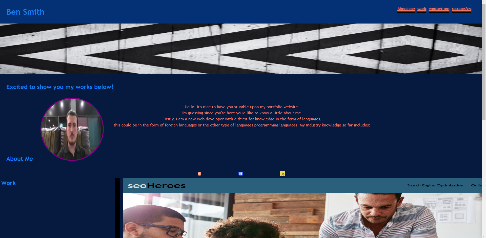

# Unit 2 Challenge: Portfolio

## motivation
My motivation for this project was to create a portfolio website for myself that outlines the creativity and new abilities that I have learned throughout the course. 

## Why 
My why for this project is because it helps me to perform a dual purpose which these are both a practical use of the skills I have learnt from the EdX bootcamp for front end web development and it also allows me to showcase my skills for the first time. 

## what problem does this solve.
The real problem this solves is that this is evidence to prove what my current level of skill and what current techniques I am able to use to create a useable webpage for employers and colleagues to have a look at. 

## what did you learn? 
I learnt that the google inspect tool is a very helpful tool for frontend web developers as we are able to see the code and make changes to the css and html whilst in the active browser, alongside this, version control with Git which has been able to help keep me motivated and project objective orientated which I am sure will be skills that are quite valuable when it comes to the jobsearch.

## what makes the project stand out?
I would say that the project doesn't scream immediately to hire me but it does effectively show what methods and techniques I have used such as where I have made comments in the source code.
## live Development link below

https://bloodfued12.github.io/my-edx-portfolio/assets/index.html